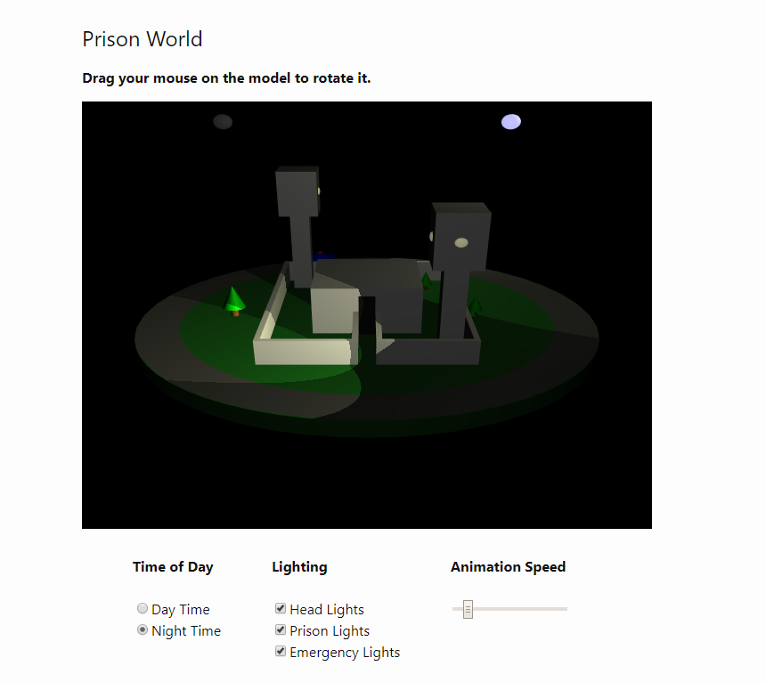

# Prison World #

#### WebGL Model and Animation ####

This is a JavaScript web application that creates a 3D model of a prison and animates patrol car that drives the perimeter of the world. There are various options to adjust the lighting and animation.

#### Dependencies ####

This application uses the WebGL 3D JavaScript library and there are some files that are used from the provided files of that library:

- [gl-matrix-min.js](https://github.com/toji/gl-matrix)

